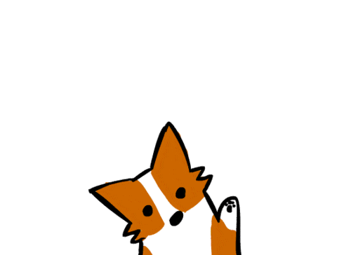

# Trillo 🛎️🏬🌴

This is a project created by Jonas Schmedtmann for his UDEMY course 'Advanced CSS and Sass: Flexbox, Grid, Animations and More!'

# About the website ☀️🌊

This is a mock-up of a travel booking application designed to emulate the experience of planning a getaway. While this app doesn't have many features, it does provide an intuitive menu where the user could explore various options for flights, car rentals, and even tours to popular destinations. Special emphasis is given to a featured hotel, complete with vivid, eye-catching photography and a detailed description. For this hotel, the app displays the location, overall user rating, and the number of votes that contributed to that rating. You'll also find a list of amenities and services included, alongside a couple of user reviews to give you a sense of what to expect. The aim of this project isn't to offer comprehensive features, but rather to give users the look and feel of a 'real' travel booking website. Sporting bright colors and a modern aesthetic, it captures the excitement and potential of planning a dream trip.

# ☝️ Learning goals

- Master advanced flexbox alignment techniques.
- Understand the manipulation of SVG icons and sprites in HTML, along with changing the color of SVG icons using CSS.
- Learn how to create modern hover effects utilizing scaleY and multiple transition properties.
- Acquire the skills to craft an infinite animation.
- Grasp the concepts behind using CSS masks with mask-image and mask-size.
- Get familiar with the use of @supports for browser-specific properties.
- Implement best practices in media queries.

###

# 🏕️

This was a great project for me to deepen my skills using flexbox, and practice using all it has to offer. I hope you enjoyed browsing the website and felt, at least a little, excited to book a trip yourself! 🙌

###

byeee

